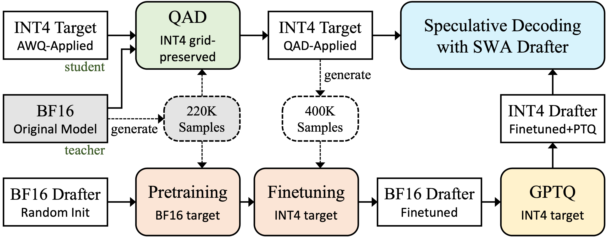

<div align="center">

# Quantize the Target, Quantize the Drafter<br>: Efficient Inference with Qwen3.5-4B

[](https://arxiv.org/abs/2607.04244)
[](https://huggingface.co/nota-ai/Qwen3.5-4B-QAD-W4A16)
[](https://huggingface.co/nota-ai/Qwen3.5-4B-DFlash-GPTQ-W4A16)


</div>

We reduce Qwen3.5-4B inference latency on a single A10G by quantizing both the target model and its speculative-decoding drafter to INT4, while maintaining quality across all three gates (MMLU-Pro, IFEval, GPQA-Diamond). This repository reproduces our 3rd-place Efficient Qwen Competition ([AdaptFM @ ICML 2026](https://adaptfm.gitlab.io/)) entry end to end. It combines three techniques:

- **Quantization-Aware Distillation (QAD):** trains the INT4 target model to follow the original BF16 model's distribution, recovering the accuracy that post-training quantization (PTQ) loses.
- **Two-Stage Training for Block-Diffusion Drafter:** pretrains the DFlash drafter with the BF16 target, then finetunes it on the QAD-applied INT4 target so it aligns with the quantized target distribution better than direct QAD-target training does.
- **Drafter Optimization:** applies INT4 GPTQ and Sliding-Window Attention (SWA) to reduce drafter overhead while maintaining acceptance length.

**Hardware:** Final serving and evaluation run on a single NVIDIA A10G 24 GB GPU. Retraining the QAD target and drafter requires an 80 GB-class multi-GPU machine, with at least 2 GPUs and preferably 8 GPUs. The gated prompt dataset is a one-time ~42 GB download.

## Installation

```bash
uv sync --all-extras                     # one venv for every stage (see pyproject.toml)
uv pip install -e src/SpecForge --no-deps    # DFlash training framework
printf 'HF_TOKEN=hf_...\nHF_HOME=/path/to/hf_cache\n' > .env    # HF_TOKEN is REQUIRED (gated data, see below); WNB_TOKEN optional (wandb)
```

**`HF_TOKEN` is required.** Two datasets are gated: [nvidia/Nemotron-Post-Training-Dataset-v2](https://huggingface.co/datasets/nvidia/Nemotron-Post-Training-Dataset-v2) (Stage-1 prompts) and [Idavidrein/gpqa](https://huggingface.co/datasets/Idavidrein/gpqa) (the GPQA-Diamond gate). Accept each one's terms on its dataset page, then put the token in `.env`. The models and all other eval sets are public.

## Run the pipeline

<div align="center">
  
</div>

The four stages above map to these scripts. Run them top to bottom:

| Stage | Output | Command |
|:--|:--|:--|
| **1. Data Generation** | 220K conversations from the BF16 teacher (prompt set rebuilt from the shipped uuid manifest) | `src/data_generator/` (teacher = `Qwen/Qwen3.5-4B`) |
| **2. Target Model** | grid-preserved INT4 QAD → compressed-tensors(ct) target, then regen 400K convs with it | `scripts/prepare_data.sh` → `train_multi.sh` → `pack_ct.sh`, then `src/data_generator/` |
| **3. Draft Model** | pretrain (220K) → finetune (400K) → GPTQ-W4A16 | `train_drafter_pretrain.sh` → `train_drafter_finetune.sh` → `quant_dflash_gptq.sh` |
| **4. Speculative Serving** | W4 target + W4 draft, SWA 1024 | `PYTHONPATH=src python -m serving` + `EQC_DFLASH_SWA_WINDOW=1024` |

`src/data_generator/` runs twice (BF16 teacher for 220K, then the QAD model for 400K); the
draft is trained in two phases (220K then 400K) so it learns to mimic the QAD-applied model.

<details><summary><b>Stages 1 & 2: Data Generation</b> (same pipeline, two teachers)</summary>

```bash
cd src/data_generator
# Stage 1 prompts: rebuild the ORIGINAL 220K set from the shipped uuid manifest
# (219,602 pointers into the gated dataset; downloads all splits ~42GB once):
HF_TOKEN=... ../../.venv/bin/python rebuild_prompts_from_manifest.py --output prompts_220k.jsonl
# Stage 2 prompts (400K fresh draw), deterministic sampler:
HF_TOKEN=... ../../.venv/bin/python sample_nemotron.py --output prompts.jsonl \
    --max-prompt-tokens 14336 --tokenizer Qwen/Qwen3.5-4B --shuffle

MODEL=/path/to/teacher GPUS="0 1 2 3" PORTS="8124 8125 8126 8127" ./serve.sh
../../.venv/bin/python generate_responses.py --input <PROMPTS> --output <OUT> \
    --model teacher --base-url http://localhost:8124/v1,http://localhost:8125/v1,http://localhost:8126/v1,http://localhost:8127/v1 \
    --concurrency 1200 --timeout 900 --max-tokens 16384 --keep-truncated --log-every 500
./stop.sh
```

Write each run's `<OUT>` to the exact path the downstream steps read:

| run | teacher (`MODEL=`) | `--output <OUT>` | consumed by |
|:--|:--|:--|:--|
| Stage 1 (220K) | BF16 `Qwen/Qwen3.5-4B` | `../../data/qwen3_5_nemotron_combined_regen.jsonl` | `scripts/prepare_data.sh`, drafter pretrain |
| Stage 2 rerun (400K) | packed QAD model (`runs/qad_nemotron_regen/local_model_ct_ckpt5000`) | `regen_ckpt5000.jsonl` (stays in `src/data_generator/`) | drafter finetune, GPTQ calib builder |
</details>

<details><summary><b>Stage 2: Target Model</b> (grid-preserving INT4 QAD)</summary>

Load `cyankiwi/Qwen3.5-4B-AWQ-4bit`, pin its INT4 grid via modelopt `_amax`, and distill
the BF16-latent weights against the BF16 teacher (per-token KL). The grid never moves, so it
deploys as INT4-weight / FP16-act with zero re-quant noise.

```bash
scripts/prepare_data.sh                                                   # tokenize + pack (seq 16384)
scripts/train_multi.sh 0,1,2,3,4,5,6,7 src/configs/train_config.yaml          # ZeRO-2, needs 2+ GPUs (see note)
scripts/pack_ct.sh checkpoint-5000                                        # → ct pack + dense-bf16 twin
```

- **QAD training needs 2+ GPUs (80 GB each):** the seq-16384 by 248K-vocab logits OOM a
  single card; ZeRO-2 sharding across 2+ GPUs fits (8 recommended, as shown).
- `pack_ct.sh checkpoint-5000` resolves the checkpoint under
  `runs/qad_nemotron_regen/ckpts_full/` (or `ckpts_smoke/` for smoke runs) and writes
  two dirs: `local_model_ct_ckpt5000` (compressed-tensors, what the serve configs
  load) and `local_model_ct_ckpt5000-bf16` (dense dequantized twin, the target for
  drafter finetune + GPTQ calibration).
- Packing goes through `src/qad/pack_bf16_to_ct.py` (not `mtq.compress`, which
  re-quantizes off-grid).
</details>

<details><summary><b>Stage 3: Draft Model</b> (pretrain, finetune, quant)</summary>

```bash
scripts/train_drafter_pretrain.sh 8 flex_attention     # scratch on 220K → outputs/dflash-pretrain
# set INIT_CKPT to the best pretrain ckpt, then:
scripts/train_drafter_finetune.sh 8 flex_attention     # warm-start on 400K → outputs/dflash-finetune
.venv/bin/python src/drafter_quant/build_calib.py --source src/data_generator/regen_ckpt5000.jsonl \
    --out runs/drafter_quant/calib --total 256
scripts/quant_dflash_gptq.sh                           # GPTQ-W4A16 → runs/drafter_quant/dflash_w4_gptq
```

Targets: the pretrain stage distills against the BF16 base `Qwen/Qwen3.5-4B` (a hub id,
auto-downloaded, the teacher that produced the 220K set); finetune and GPTQ calib switch
to `runs/qad_nemotron_regen/local_model_ct_ckpt5000-bf16`, the dense twin
`scripts/pack_ct.sh` wrote next to the ct pack.

`--dataloader-num-workers 0` is mandatory (fork-CUDA deadlock); both scripts hold effective
batch 32. On vLLM 0.22.1 a W4 target forces a W4 draft, so the quant step isn't optional.
</details>

## Evaluation

Everything runs against one server (a FastAPI proxy in front of `vllm serve`), so start it
once and point the harnesses at it over HTTP.

First pre-fetch the datasets while you're online. The quality harness reads them offline,
and GPQA is gated:

```bash
HF_TOKEN=hf_... .venv/bin/python - <<'PY'
from datasets import load_dataset
load_dataset("TIGER-Lab/MMLU-Pro")                # public
load_dataset("google/IFEval")                     # public
load_dataset("Idavidrein/gpqa", "gpqa_diamond")   # gated, needs HF_TOKEN
PY
```

Start the server (QAD target + W4 draft + SWA 1024) and wait for `/ping`:

```bash
export PATH="$PWD/.venv/bin:$PATH"       # so the spawned `vllm` resolves
CUDA_VISIBLE_DEVICES=0 PYTHONPATH=src EQC_CONFIG_PATH=src/configs/serve_dflash_gptq.yaml \
  EQC_PORT=8080 EQC_VLLM_INTERNAL_PORT=28080 EQC_VLLM_MAX_MODEL_LEN=16384 \
  EQC_DFLASH_QUANT_PATCH=1 EQC_DFLASH_SWA_WINDOW=1024 \
  .venv/bin/python -m serving
curl localhost:8080/ping                 # returns 200 once loaded
```

`EQC_VLLM_MAX_MODEL_LEN=16384` is only there to fit GPQA's long thinking output; the
latency prompts don't need it.

Quality gates (`QUALITY_LIMIT=1.0` for the full run, `0.1` for a quick sample):

```bash
QUALITY_LIMIT=1.0 CONTAINER_URL=http://localhost:8080 \
  .venv/bin/python src/eval_harness/run_quality_local.py
```

Latency, on LongBench-v2 slices (build the prompt file once, then measure):

```bash
.venv/bin/python src/eval_harness/prepare_longbench_latency.py
LATENCY_PROMPTS_FILE=src/eval_harness/latency_prompts_longbench.json \
  CONTAINER_URL=http://localhost:8080 .venv/bin/python src/eval_harness/run_latency_harness.py
```

Mean acceptance length is measured separately with the vendored DFlash benchmark (build
its LongBench-v2 cache once with `scripts/prepare_longbench_bench.py`); see
`src/dflash_runtime/README.md`.


## Layout

Two top-level directories: `scripts/` (entrypoints) and `src/` (everything they run).

```text
.
├─ scripts/               one entrypoint per stage, plus `gpu_lock.sh` (A10G emulation)
└─ src/
   ├─ data_generator/     teacher regen: Nemotron prompts to responses  (stages 1 & 2)
   ├─ qad/                grid-preserving INT4 distillation to a ct model  (stage 2)
   ├─ SpecForge/          DFlash drafter training framework, vendored  (stage 3)
   ├─ drafter_quant/      GPTQ-W4A16 of the draft, plus calib builder  (stage 3)
   ├─ dflash_runtime/     vendored `dflash` package: the DFlash draft-model
   │                        implementation vLLM imports at serve/eval time
   ├─ vllm_plugin/        vLLM plugin (`eqc_vllm_plugin`): W4-draft loading + drafter SWA
   ├─ serving/            FastAPI proxy that spawns `vllm serve`  (stage 4)
   ├─ eval_harness/       quality gates + latency, over HTTP
   ├─ configs/            train + serve YAMLs
   ├─ templates/          no-think chat template
   └─ figures/            README assets
```

`src/dflash_runtime` and `src/vllm_plugin` are editable packages installed by
`uv sync`; `src/serving` is run in place (hence `PYTHONPATH=src`).

## Scope & external assets

Code only: weights, datasets, and checkpoints are gitignored build products. The one
shipped data file is a content-free uuid manifest (`src/data_generator/manifests/`) that
rebuilds the 220K corpus locally instead of redistributing it.

- **Faithful, not bit-exact:** prompt sets are deterministic, but teacher responses are
  sampled (temperature 0.7, no fixed seed unless `generate_responses.py --seed` is set),
  so reproduced numbers differ slightly from ours.
- **Third-party terms apply:** the Qwen3.5-4B and `cyankiwi/Qwen3.5-4B-AWQ-4bit` models,
  the Nemotron-Post-Training-Dataset-v2 and GPQA datasets, and the competition rules keep their own
  licenses. Don't redistribute the downloaded or regenerated artifacts.

## Acknowledgements

- **[SpecForge](https://github.com/sgl-project/SpecForge) / [DFlash](https://github.com/z-lab/dflash):**
  drafter-training framework and speculative-decoding method, vendored under
  `src/SpecForge/` and `src/dflash_runtime/` (MIT; upstream `LICENSE` files retained in-tree).
- **[Qwen3.5-4B](https://huggingface.co/Qwen/Qwen3.5-4B)** (base model) and
  **[cyankiwi/Qwen3.5-4B-AWQ-4bit](https://huggingface.co/cyankiwi/Qwen3.5-4B-AWQ-4bit)**
  (INT4 initialization).
- **[Nemotron-Post-Training-Dataset-v2](https://huggingface.co/datasets/nvidia/Nemotron-Post-Training-Dataset-v2):**
  prompt source for the distillation corpus.
- **[Efficient Qwen Competition](https://adaptfm.gitlab.io/call-for-competition/)** (AdaptFM workshop @ ICML 2026).

We also deeply appreciate the generous GPU resource support from
**[Gwangju AICA](https://www.aica-gj.kr/main.php)**.

This repository's code is licensed under [Apache-2.0](LICENSE); the third-party models and
datasets referenced above are subject to their own licenses.

## 📚 Citation
If you find our work useful, please cite our [paper](https://arxiv.org/abs/2607.04244):

```bibtex
@article{kim2026quantize,
  title   = {Quantize the Target, Quantize the Drafter: Efficient Inference with Qwen3.5-4B},
  author  = {Jaeyeon Kim and Jewon Lee and Bo-Kyeong Kim},
  journal = {arXiv preprint arXiv:2607.04244},
  year    = {2026}
}
```